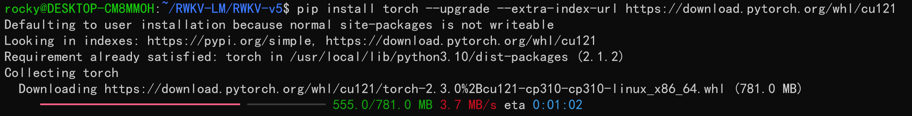
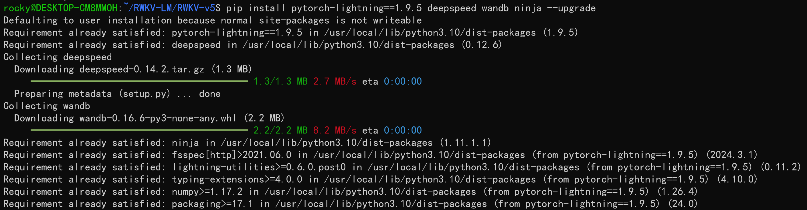
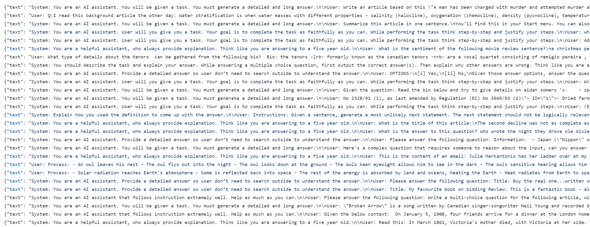
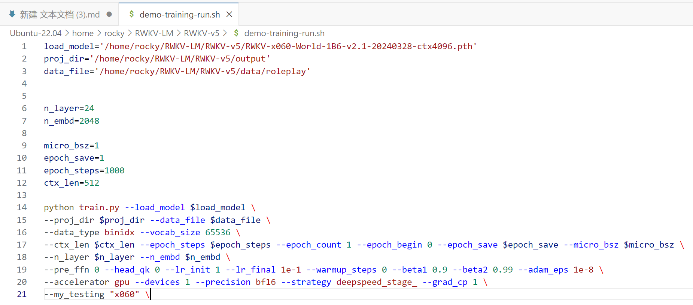
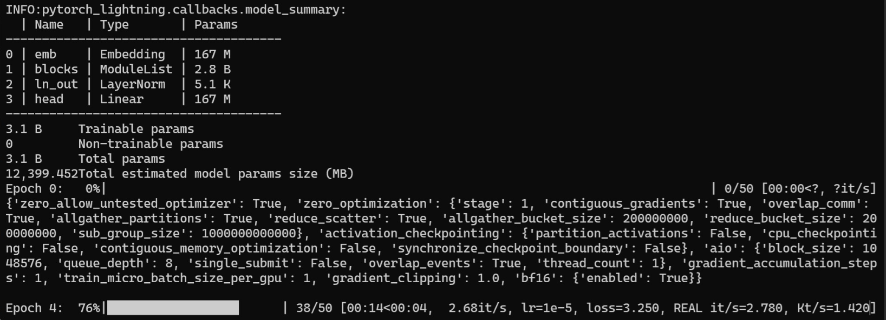

##  RWKV 模型全参微调教程（入门版）

> 注意：本文旨在为刚接触 RWKV 模型的用户提供开箱即用的全量微调方法，文中使用的仓库为 RWKV 开源社区成员整理的“微调懒人包”，和官方 [RWKV-LM 仓库](https://github.com/BlinkDL/RWKV-LM.git)中的微调方法**不兼容**。


首先，准备一个 Linux 环境（可以是 WSL）和支持 CUDA 的 NVIDIA 显卡，然后往下阅读本文。

## 配置训练环境

要训练 RWKV 模型，首先要配置训练环境。

1. **配置虚拟环境（conda）**

本文的虚拟环境默认为 conda ，如果不知道如何配置 Linux 系统的 conda ，请参考[**此文章**](https://zhuanlan.zhihu.com/p/166102942)。

2. **安装训练所需的软件**

要获得 RWKV 模型的最佳训练性能，请使用 python 3.10、torch 2.1.2+cu121（或最新版本）、cuda 12.3+、最新的 deepspeed，但保持 pytorch-lightning ==1.9.5 。

在 Linux 环境中依次运行以下命令：
```
pip install torch --upgrade --extra-index-url https://download.pytorch.org/whl/cu121
pip install pytorch-lightning==1.9.5 deepspeed wandb ninja --upgrade
```
第一条命令通过指定 url 安装 cu121 版本的 torch ： 



第二条命令安装 PyTorch Lightning、Deepspeed、WandB（Weights & Biases）、Ninja 包，并指定安装 1.9.版本的 PyTorch Lightning 。



-- upgrade 参数意味着如果环境中已经安装了对应的软件包，则将其升级到最新版本。

3. **检查 CUDA 环境**

依次运行以下命令，检查 CUDA 库是否可用：
```
python3 # 启动 python

import torch # 导入 torch 包

torch.cuda.is_available() # 检查 CUDA 是否可用
```


如果返回值为 True ，证明 CUDA 环境可用。如果返回 False ，请重新安装 CUDA 环境（cuda 12.3+）。

## 克隆 RWKV-LM 仓库

在 Linux 或 WSL 中，使用 git 命令克隆 RWKV-LM 仓库​：
```
git clone https://github.com/shoumenchougou/RWKV-LM.git
```

克隆完成后，使用 cd RWKV-LM/RWKV-v5 命令进入 RWKV-v5 文件夹。


## ​选择基底模型和语料

### 下载基底 RWKV 模型

你需要选择一个 RWKV 基底模型作为微调训练的起点，下载 RWKV 模型并将其放在 RWKV-v5/model 文件夹（推荐下载最新的 RWKV-6 架构模型）：

注意：如果你无法访问以下网站，请将链接中的 "huggingface.co" 改成 "hf-mirror.com"，以访问国内的镜像网站。

```
# RWKV-5-World-7B （稳定版本）下载链接：

https://huggingface.co/BlinkDL/rwkv-5-world/resolve/main/RWKV-5-World-7B-v2-20240128-ctx4096.pth

# RWKV-6-World-1.6B-v2.1 （V2.1 使用 2.5 T tokens 数据集训练）下载链接：

https://huggingface.co/BlinkDL/rwkv-6-world/resolve/main/RWKV-x060-World-1B6-v2.1-20240328-ctx4096.pth

# RWKV-6-World-3B-v2.1 下载链接：

https://huggingface.co/BlinkDL/rwkv-6-world/resolve/main/RWKV-x060-World-3B-v2.1-20240417-ctx4096.pth

# RWKV-6-World-7B-v2.1 （训练中）下载链接：

https://huggingface.co/BlinkDL/temp-latest-training-models/resolve/main/rwkv-x060-7b-world-v2.1-53%25trained-20240420-ctx4k.pth
```

由于本文介绍的是 RWKV 全参微调方法，如果你在使用消费级显卡（4090 或更低级），对 1.5B 或更大参数的 RWKV 模型进行微调训练可能会失败。

如果你正在使用消费级显卡，建议尝试微调 RWKV-5-World-0.4B，下载链接：

```
https://huggingface.co/BlinkDL/rwkv-5-world/blob/main/RWKV-5-World-0.4B-v2-20231113-ctx4096.pth
```

所有 RWKV 模型的完整列表请在 https://huggingface.co/BlinkDL 中查看，国内可以访问的 HF 镜像链接： https://hf-mirror.com/BlinkDL  。


## 收集训练语料（数据集）

请遵循以下步骤，收集你的训练数据集，并将其放在 RWKV-v5/data 文件夹里面。

1. **整理 jsonl 语料**

首先确认“你希望 RWKV 模型学习哪些知识”。这里的知识可以是某一领域的资料，比如法律问答、金融知识等；也可以是某类任务的文本，如材料总结、角色扮演等。总而言之，你需要收集此类数据，并将其转化为特定的 jsonl 格式。

下面是各类内容的 jsonl 格式参考：

```
单轮问答： {"text": "User: 问题\n\nAssistant: 答案"}

多轮对话例子：{"text": "User: 问题一\n\nAssistant: 答案一\n\nUser: 问题二\n\nAssistant: 答案二"}

材料问答：{"text": "Instruction: 问题\n\nInput: 材料\n\nResponse: 答案"}

内容生成/续写：{"text": "将每篇文章的内容变成 JSONL 的一行，即使是一百万字的小说也变成一行。"} 或者 {"text": "《标题》\n正文内容"}
```
整理完成的 jsonl 文件应该是这样的：



2. **将 jsonl 文件转化为 binidx 文件**

在 RWKV-LM/RWKV-v5 目录中运行以下命令，可以将 data 文件夹中的 jsonl 文件转成 binidx 文件 ：

```
python3 tools/preprocess_data.py --input ./data/sample.jsonl --output-prefix ./data/sample --vocab ./rwkv_vocab_v20230424.txt --dataset-impl mmap --tokenizer-type RWKVTokenizer --append-eod
```


如果你在使用自己的 jsonl 数据集，这条命令有两个需要修改的参数：

- --input ./data/sample.jsonl # 作为输入的 jsonl 文件路径

- --output-prefix ./data/sample # 输出的 bin 和 idx 文件路径

将 sample.jsonl 改成你自己的 jsonl 文件名称，其他参数保持默认即可。

出现以下提示，意味着转换已经完成：


## 修改训练参数 

使用任意文本编辑器（如 vscode）打开 demo-training-run.sh 文件，可以调整训练参数，进而控制微调的训练过程和训练效果。：



以下是一次调参过程的记录：

1. 调整文件路径

**--load_model** ：基底 RWKV 模型的路径，一般在 model 文件夹。


上图中，基底 RWKV 模型的路径应该设置为：
```
model/RWKV-x060-World-1B6-v2.1-20240328-ctx4096.pth
```
proj_dir 是训练的输出文件夹，用于存放完成训练后的微调模型。


在示例中，我们将输出文件夹的路径设置为：
```
proj_dir ='output'
```

**data_file** 是训练数据集的路径，注意路径中不需要带 bin 和 idx 后缀，仅需文件名称。


上图中，"sample_text_document" binidx 数据集路径可以设置为：
```
data_file='data/sample_text_document'
```

2. n_layer 和 n_embd 参数

基底 RWKV 模型的参数大小不同，训练时使用的 n_laye 和 n_embd 数值也不一样。以下是不同参数的 RWKV 模型和 n_laye 和 n_embd 数值的对照列表：
```
0.1B：n_layer 12 | n_embd 768

0.4B：n_layer 24 | n_embd 1024

1.5B：n_layer 24 | n_embd 2048

3B：n_layer 32 | n_embd 2560

7B：--n_layer 32 | n_embd 4096
```

3. 其他重要训练参数
   
```
micro_bsz=1 # 根据显存的大小调整，微调从 1 开始尝试增大。

epoch_save=5 # 每隔多少个训练轮次保存一次训练模型，调小需要注意你的存储空间是否充足

epoch_steps=1000 # 每轮的训练步数，增大会使每个训练轮次（epoch）的时间变长

ctx_len=512 # 微调模型的上下文长度，根据你的需求而定

```

4. 基本保持默认值的训练参数

下面列出了脚本中其他可修改的训练参数，及其修改的效果。

```
--data_type binidx # 训练语料的文件格式，支持"utf-8", "utf-16le", "numpy", "binidx", "dummy", "wds_img", "uint16"

--vocab_size 65536 # 词表大小 ，默认 65536， 设置为 0 时意味着模型将自动确定词汇表的大小

--epoch_count 1 # 总训练轮次

--epoch_begin 0 # 初始训练轮次，表示从第 N 个 epoch 开始加载

--pre_ffn 0 # 用 ffn 替换第一个 att 层（有时更好）

--head_qk 0 # 通常保持默认值 0（关闭）

--lr_init 1e-5 # 初始学习率，微调建议保持 1e-5，如果觉得 loss 下降速度太慢可以适当加大，不超过 5e-5

--lr_final 1e-5 # 最终学习率，微调建议保持 1e-5，当你对微调熟悉之后可以自行改动

--warmup_steps 0 # 预热步骤，微调新手建议设为 0 。如果你加载了一个模型，可以试试 50

--beta1 0.9 # Adam 优化器的 beta1 参数，通常使用 0.9

--beta2 0.999 # Adam 优化器的 beta2 参数模型，接近收敛时使用 0.999

--adam_eps 1e-8 # Adam 优化器的 epsilon 参数，通常 1e-8

--accelerator gpu # 加速器类型，虽然可选 cpu/gpu ，但目前 cpu 基本不支持训练

--devices 1 # 单显卡为 1，多卡就按卡数填写

--precision  # 训练精度，默认 bf16 ，支持"fp32", "tf32", "fp16", "bf16"

--strategy deepspeed_stage_1 # lightning 吃的训练策略参数，微调时建议 deepspeed_stage_1

--grad_cp 1 # 梯度累积的步数，设置为 0 训练更快但需要更多显存，设置为 1 慢但节省显存

--my_testing "x060" # 训练的 RWKV 模型版本，RWKV-v5 模型选择 x052 ,RWKV-v6 模型写 x060

```

参数调整完成后，请记得保存 demo-training-run.sh 文件。

## 开始训练

在 RWKV-V5 目录中，使用以下命令运行  demo-training-run.sh  脚本：
```
sh demo-training-run.sh
```
成功运行后，应该可以看到类似于这样的效果：



## 常见问题​：

1. jsonl 转 binidx 时出现 ModuleNotFoundError: No module named 'xxx' 错误


解决方法：这是因为缺少了对应的软件包，请运行命令 pip install xxx 进行安装。

2. jsonl 转 binidx 时出现 JSONDecodeError:Unmatched '"' when decoding 'string'! 报错
   


解决方法：这是因为你的 jsonl 文件缺少引号，请检查 jsonl 文件的所有行是否都符合以下引号格式：


3. 克隆 GitHub 仓库时出现 fatal: unable to access 'https://github.com/shoumenchougou/RWKV-LM.git/': GnuTLS recv error (-110): The TLS connection was non-properly terminate

解决方法：这是你的设备出现了网络问题，请调整网络。

4. 运行 sh 脚本时出现：train.py: error:unrecognized arguments:\ 

解决方法：请把 sh 脚本的所有 \ 去掉，每两个参数之间用空格隔开。

5. 运行脚本开始训练后，出现显存 （memory/VRAM） 不足相关报错

解决方法：显存不足，需要升级显卡设备。

